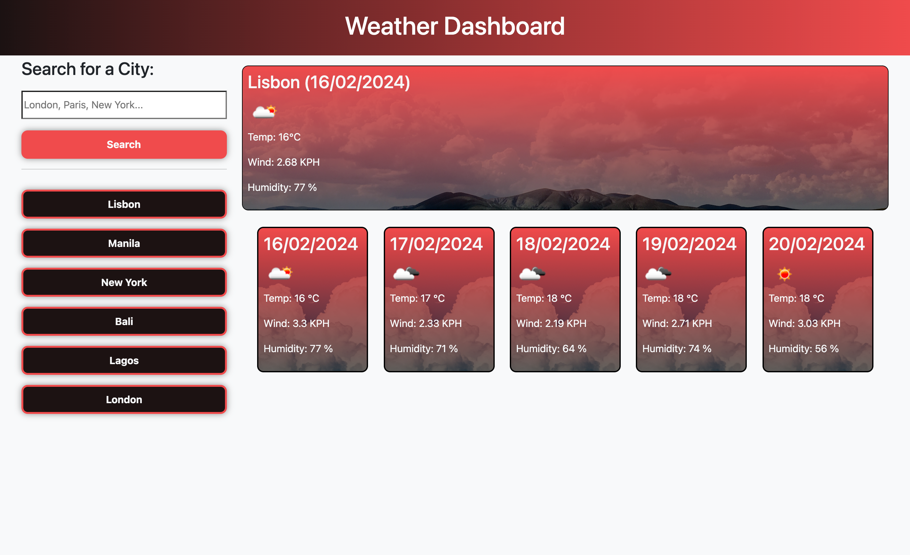
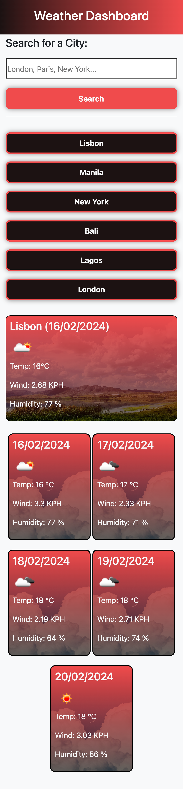

# 08 Weather Dashboard Challenge

# Weather Dashboard

## Description

The Weather Dashboard is a dynamic web application that allows users to search for and view current and future weather conditions in multiple cities. Utilizing the 5 Day Weather Forecast API from OpenWeatherMap, this dashboard provides travelers with essential weather data to help plan their trips more effectively. The application features dynamically updated HTML and CSS, ensuring a responsive and intuitive user interface.

## Features

- **City Search**: Users can search for cities to retrieve weather data.
- **Current Weather**: Displays the city name, date, weather condition icons, temperature, humidity, and wind speed for the searched city.
- **5-Day Forecast**: Shows the date, weather condition icons, temperature, and humidity for the next five days.
- **Search History**: Saves search history in local storage, allowing users to quickly revisit previous searches and view current and future conditions for those cities.

## How to Use

1. **Search for a City**: Enter a city name in the search box and click the "Search" button or press enter.
2. **View Weather Data**: The current weather conditions and a 5-day forecast for the searched city will be displayed on the screen.
3. **Access Search History**: Click on a city name in the search history list to quickly access weather data for that city again.

## Technologies Used

- HTML
- CSS
- JavaScript
- Bootstrap for styling
- OpenWeatherMap API for weather data

Remember to replace any placeholder text with information specific to your project. If your project is hosted online, it's also helpful to include a link to the live application.

## Weather Dashboard Application
The following images shows the Weather Dashboard displaying a working application.

> **Note** This is a screenshot of the deployed Weather Dashboard Start Page.

> **Note** This is a screenshot of the deployed Weather Dashboard Questions Page.

> **Note** This is a video of the Weather Dashboard displaying functionality.

## References
[MDN Web Docs on JavaScript:](https://developer.mozilla.org/en-US/docs/Web/JavaScript)

[MDN Web Docs - Using Fetch for API Calls in JavaScript](https://developer.mozilla.org/en-US/docs/Web/API/Fetch_API/Using_Fetch)

[API Documentation | OpenWeatherMap - Documentation](https://openweathermap.org/api)

[MDN Web Docs - Date and Time](https://developer.mozilla.org/en-US/docs/Web/JavaScript/Reference/Global_Objects/Date)

## License
Licensed under [MIT License](LICENSE.md).

## GitHub Repository
URL: https://github.com/adebayoadebisi/08-weather-dashboard-challenge

## Deployed Web Application
URL: https://adebayoadebisi.github.io/08-weather-dashboard-challenge/